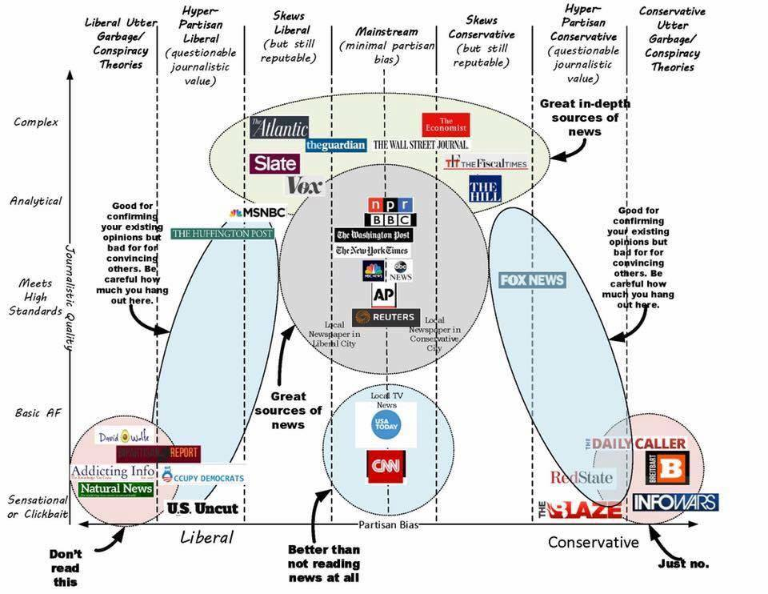

# TreeHacks2017

https://devpost.com/software/spectrum-tvf0u4

## Goal

Provide casual news readers additional insightful and contextual information 
about what they're reading and ultimately broaden their view

## Summary

## Components

### Front end
- Popup
    - Summary
    - Article Spectrum
    - Suggestions (Content Based)
        - Suggestion Spectrum

### Backend
- News Spectrum Indexing (Joseph)
    - IBM AlchemyLanguage API -> Indexing (Joseph)
    - Suggestions Generator (Joseph)
- Summarization Generator (Ryan)

## Workflow

### Backend
- News Spectrum Indexing
    - Test `OccupyDemocrats`, `Breitbart`, `NPR`
    - Generate corpus of each
        -  Test whether there is significant correlation between sentiment

## Resources

### News Sources

- OccupyDemocrats
- Us.Uncut
- HuffingtonPost
- MSNBC
- Atlantic
- Slate
- Vox
- The Guardian
- NPR
- BBC
- WashingtonPost
- New York Times
- ABC News
- AP
- Reuters
- USA Today
- CNN
- The Wall Street Journal
- The Economist
- The Fiscal Times
- The Hill
- Fox News
- Red State
- The Blaze

#### To use as baselines

- Huffington Post
- The Washington Post
- Fox News

#### To produce corpus:
- BBC
- The Economist
- The Fiscal Times
- WallStreetJournal
- MSNBC
- Occupy Democrats
